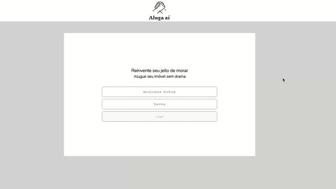

# Aluga Aí

<h1 style="text-align: center; background: white;">
  
</h1>

<h1 style="text-align: center;">
  
</h1>

## Descrição do projeto

Aluga aí foi um projeto desenvolvido como um treinamento, onde pratiquei chamadas assíncronas em APIs, React: (Context api, hooks);
 
O intuito do projeto foi desenvolver um software de locação de imóveis, a busca foi realizado
no endpoint [DEVELOPERS_MERCADO_LIVRE](https://developers.mercadolivre.com.br/pt_br/api-docs-pt-br).

## Tecnologias


 


---

## Download

```
$ git clone https://github.com/Junior030/applocacoes.git

$ npm install

$ npm start

```

#### Desenvolvido por JUNIOR HENRIQUE 👩‍💻


<a href="https://www.linkedin.com/in/juniorhenrique030/"></a>
<a href="https://github.com/Junior030">
 </a>
<a href="https://ubuntu.com/download">

</a>